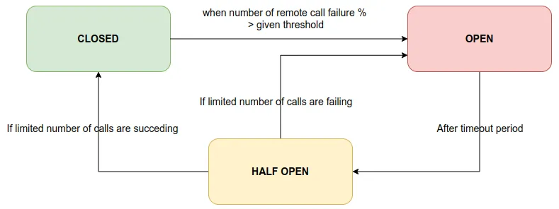
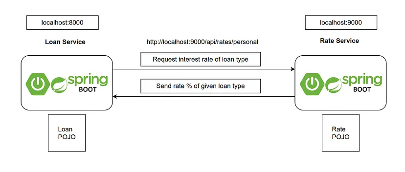

What is Circuit Breaker Pattern?
You may have already heard of circuit breakers we find in electronic items. What is the main purpose of it? Simply, break the electric flow in an unexpected scenario. Same as that, here also this micro service pattern has go the name due to the same nature it has.

This pattern comes into the picture while communicating between services. Let’s take a simple scenario. Let’s say we have two services: Service A and B. Service A is calling Service B(API call) to get some information needed. When Service A is calling to Service B, if Service B is down due to some infrastructure outage, what will happen? Service A is not getting a result and it will be hang by throwing an exception. Then another request comes and it also faces the same situation. Like this request threads will be blocked/hanged until Service B is coming up! As a result, the network resources will be exhausted with low performance and bad user experience. Cascading failures also can happen due to this.

In such scenarios, we can use this Circuit Breaker pattern to solve the problem. It is giving us a way to handle the situation without bothering the end user or application resources.

How the pattern works? 💥
Basically, it will behave same as an electrical circuit breaker. When the application gets remote service call failures more than a given threshold circuit breaker trips for a particular time period. After this timeout expires, the circuit breaker allows a limited number of requests to go through it. If those requests are getting succeeded, then circuit breaker will be closed and normal operations are resumed. Otherwise, it they are failing, timeout period starts again and do the rest as previous.

Life Cycle of Pattern States 💥
There are 3 main states discussed in Circuit Breaker pattern. They are:

CLOSED
OPEN
HALF OPEN
Let’s understand the states briefly….

CLOSED State
When both services which are interacting are up and running, circuit breaker is CLOSED. Circuit breaker is counting the number of remote API calls continuously.

OPEN State
As soon as the percentage of failing remote API calls is exceeding the given threshold, circuit breaker changes its state to OPEN state. Calling micro service will fail immediately, and an exception will be returned. That means, the flow is interrupted.

HALF OPEN State
After staying at OPEN state for a given timeout period, breaker automatically turns its state into HALF OPEN state. In this state, only a LIMITED number of remote API calls are allowed to pass through. If the failing calls count is greater than this limited number, breaker turns again into OPEN state. Otherwise it is CLOSED.

🔴 I have only allowed actuator to display circuit breaker details. Later we will add the circuit breaker configuration here. For now, it’s not needed.

Now we can start rate-service and see check the API we need. Go to http://localhost:119001/api/loans?type=personal and see the result. You should get this response.

[
{"id": 1,"type": "PERSONAL","amount": 200000,"interest": 20000},    
{"id": 3,"type": "PERSONAL","amount": 100000,"interest": 10000}
]

Add Circuit Breaker Configs 💥
Let’s add Resilience4j circuit breaker configurations. Add this to application.yml in loan-service.

resilience4j:
    circuitbreaker:
        instances:
        loan-service:
        registerHealthIndicator: true
        failureRateThreshold: 50
        minimumNumberOfCalls: 5
        automaticTransitionFromOpenToHalfOpenEnabled: true
        waitDurationInOpenState: 5s
        permittedNumberOfCallsInHalfOpenState: 3
        slidingWindowSize: 10
        slidingWindowType: COUNT_BASED

failureRateThreshold—Expected percentage of the failure threshold.
I have set it as 50%. It means, when total failed remote calls % is equal or greater than 50%, breaker will be active to stop furthermore requests.
minimumNumberOfCalls — Minimum number of total API calls to decide failure percentage to enable the breaker.
I have set it as 5. Let’s say 3 API calls are failing from the the first 5 API calls. It means failureRateThreshold = (3/5) * 100 = 60%.
automaticTransitionFromOpenToHalfOpenEnabled — I have set this as true. It will automatically transfer OPEN state to HALF OPEN state when it comes the right time for that transition.
waitDurationInOpenState — Timeout period before going to HALF OPEN state from OPEN state. After 5 seconds, breaker will change the state, here.
permittedNumberOfCallsInHalfOpenState — Number of LIMITED API calls that should be sent while in HALF OPEN state. I have set it as 3. So, after 3 API calls, if they are failed, then breaker will again go to OPEN state. Otherwise breaker will be CLOSED since rate-service is UP.
slidingWindowType: Here I have set the type to keep the circuit breaker behavior based on the requests counts.
Start both services. Now go to loan service actuator URL and see how circuit breaker is shown there: http://localhost:19001/actuator/health. Circuit breaker details has been highlighted in the response.

{
"status": "UP",
"components": {
"circuitBreakers": {
"status": "UP",
"details": {
"loan-service": {
"status": "UP",
"details": {
"failureRate": "-1.0%",
"failureRateThreshold": "50.0%",
"slowCallRate": "-1.0%",
"slowCallRateThreshold": "100.0%",
"bufferedCalls": 1,
"slowCalls": 0,
"slowFailedCalls": 0,
"failedCalls": 0,
"notPermittedCalls": 0,
"state": "CLOSED"
}
}
}
},
......................................
}
}
bufferedCalls —Total API calls from loan-service to rate-service
failedCalls — Total count of failed API calls from loan-service to rate-service
failureRate — (failedCalls/bufferedCalls) * 100%

Test Circuit Breaker 💥
We have to follow some ordered steps to see the changes exactly. In each step, we have to see the actuator endpoint and see how circuit breaker is behaving by changing its state. Let’s start!!! 💪

Start both micro services. Loan service is running on 119001 and Rate service is running on 19001. Am i right???
Now hit this API 2 times: http:///api/loans?type=personal. Then go and check the actuator: http://localhost:19001/actuator/health. Now bufferedCalls count has been updated into 2 as expected. Still breaker is CLOSED since rate service is UP.
{
"loan-service": {
"status": "UP",
"details": {
"failureRate": "-1.0%",
"failureRateThreshold": "50.0%",
"slowCallRate": "-1.0%",
"slowCallRateThreshold": "100.0%",
"bufferedCalls": 2,
"slowCalls": 0,
"slowFailedCalls": 0,
"failedCalls": 0,
"notPermittedCalls": 0,
"state": "CLOSED"
}
}
}
Now STOP the rate-service!! Then hit loan service API URL 3 times: http://localhost:19001/api/loans?type=personal. You should get an empty array we setup as fallback! This will lead bufferedCalls count to 5(Previous 2 and this 3). Right? At the same time, failedCalls count is updated into 3. Right?? Now failureRate becomes 60%( (3/5) * 100% ). Then it has exceeded our threshold: 50%. 😅 Then the circuit breaker changes its state to OPEN! 😍
{
"loan-service": {
"status": "CIRCUIT_OPEN",
"details": {
"failureRate": "60.0%",
"failureRateThreshold": "50.0%",
"slowCallRate": "0.0%",
"slowCallRateThreshold": "100.0%",
"bufferedCalls": 5,
"slowCalls": 0,
"slowFailedCalls": 0,
"failedCalls": 3,
"notPermittedCalls": 0,
"state": "OPEN"
}
}
}
Then wait for 5 seconds. It should then convert into HALF OPEN state after 5 seconds right? According to our configurations we have set waitDurationInOpenState to 5s…This is the timeout period…After this time period, request counts also will be reset.
{
"loan-service": {
"status": "CIRCUIT_HALF_OPEN",
"details": {
"failureRate": "-1.0%",
"failureRateThreshold": "50.0%",
"slowCallRate": "-1.0%",
"slowCallRateThreshold": "100.0%",
"bufferedCalls": 0,
"slowCalls": 0,
"slowFailedCalls": 0,
"failedCalls": 0,
"notPermittedCalls": 0,
"state": "HALF_OPEN"
}
}
}
Within HALF OPEN state, limited number of requests will be allowed to pass. In our case it is 3 in the configs the relevant value has been set as permittedNumberOfCallsInHalfOpenState: 3.
Since still rate-service is down, just try loan-service API 3 times again! http://localhost:19001/api/loans?type=personal …What happened? All 3 calls failed! Then failureRate is 100%. Again our circuit breaker will be opened.
{
"loan-service": {
"status": "CIRCUIT_OPEN",
"details": {
"failureRate": "100.0%",
"failureRateThreshold": "50.0%",
"slowCallRate": "0.0%",
"slowCallRateThreshold": "100.0%",
"bufferedCalls": 3,
"slowCalls": 0,
"slowFailedCalls": 0,
"failedCalls": 3,
"notPermittedCalls": 0,
"state": "OPEN"
}
}
}
After 5 seconds of timeout, again it will become HALF OPEN! Check again using actuator. You should be getting an empty array for loan service API call still…
Now start the rate-service!!! 😎 Then try this API 3 times again: http://localhost:19001/api/loans?type=personal ..What happened? You should get the actual result now! And what about the actuator results? See…Now circuit breaker is CLOSED! 😍 Because expected limited API calls count is successfully executed.
{
"loan-service": {
"status": "UP",
"details": {
"failureRate": "-1.0%",
"failureRateThreshold": "50.0%",
"slowCallRate": "-1.0%",
"slowCallRateThreshold": "100.0%",
"bufferedCalls": 0,
"slowCalls": 0,
"slowFailedCalls": 0,
"failedCalls": 0,
"notPermittedCalls": 0,
"state": "CLOSED"
}
}
}
Now we practically saw how breaker is behaving right? Isn’t amazing?? 😎 It is working as expected guys!!!